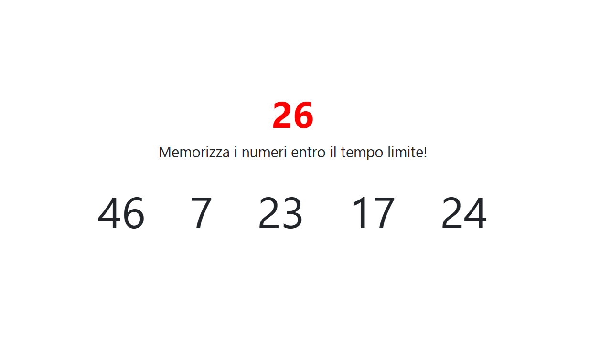

<h1 align="center">Simon Says</h1>

###

  
  
  
  
  
  
  

###

Descrizione: Visualizzare in pagina 5 numeri casuali. Da lì parte un timer di 30 secondi. Dopo 30 secondi i numeri scompaiono e appaiono invece 5 input in cui l'utente deve inserire i numeri che ha visto precedentemente, nell'ordine che preferisce.  Dopo che sono stati inseriti i 5 numeri, il software dice quanti e quali dei numeri da indovinare sono stati individuati.  NOTA: non è importante l'ordine con cui l'utente inserisce i numeri, basta che ne indovini il più possibile.  BONUS: Inseriamo la validazione: se l'utente mette due numeri uguali o inserisce cose diverse da numeri lo blocchiamo in qualche modo. Se l’utente ha inserito qualcosa di non valido, segnaliamolo visivamente nel form.  Consigli del giorno:  Pensate prima in italiano. Dividete in piccoli problemi la consegna. Individuate gli elementi di cui avete bisogno per realizzare il programma. Immaginate la logica come fosse uno snack: "Dati 2 array di numeri, indica quali e quanti numeri ci sono in comune tra i due array"

###

